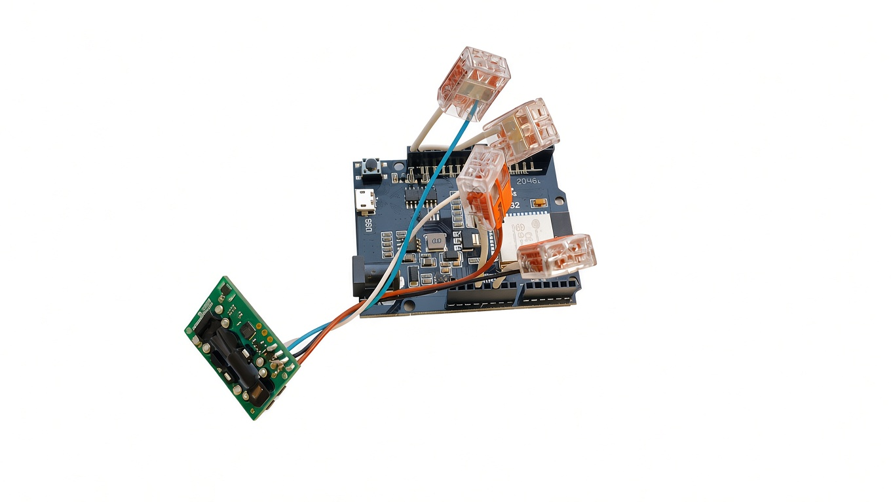
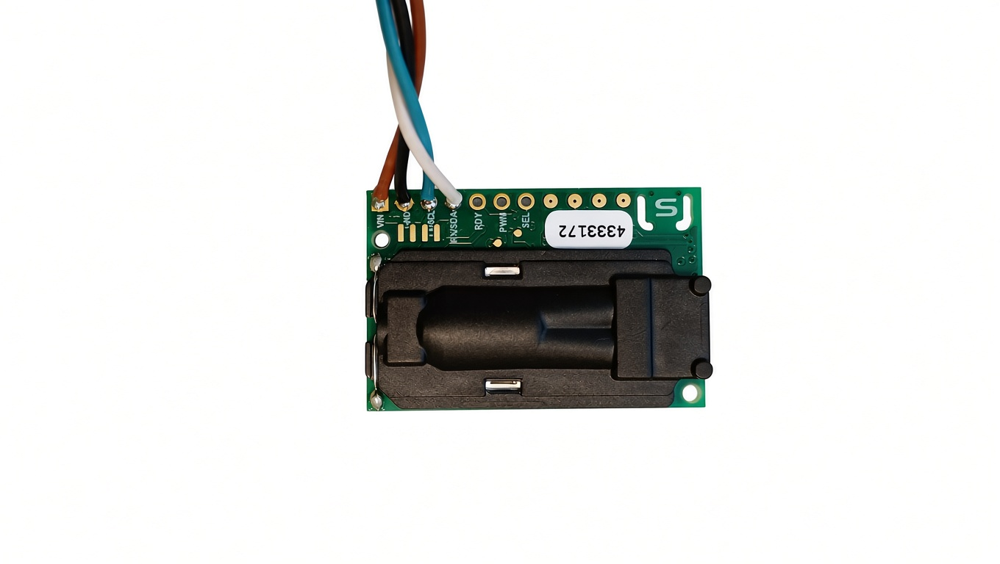
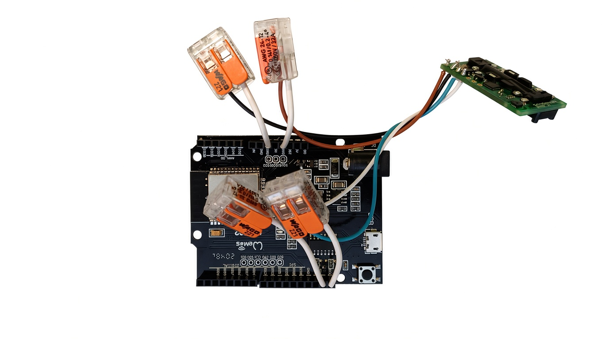

# SCD30-Wemos

ESP32 / Wemos D1 R32 -projekti Sensirion SCD30 -anturille.

ESP32 lukee SCD30:lta: - CO₂-pitoisuuden - lämpötilan - suhteellisen
kosteuden

Mittaustiedot julkaistaan MQTT-brokerille JSON-muodossa. Laitteessa on
myös WiFi-asetusportaali.

## Versiot

-   **V5 Basic** -- yksinkertainen ja helposti seurattava oppimisversio.
-   **V6 Secure** -- V5:n jatkokehitys, jossa MQTT TLS-, asetussivun ja
    syötteiden turvallisuutta on parannettu.

> Suositus: tutustu V5:een opiskelua varten ja käytä V6:ta varsinaisessa
> käytössä.

## Projektin rakenne

``` text
SCD30-Wemos/
├── README.md
├── LICENSE
├── .gitignore
├── images/
│   ├── scd30-wemos.jpg
│   ├── scd30-sensor.jpg
│   └── scd30-wemos-wiring.jpg
├── docs/
│   ├── version-5.md
│   └── version-6.md
└── examples/
    ├── SCD30_WLAN_MQTT_v5/
    │   └── SCD30_WLAN_MQTT_v5.ino
    └── SCD30_WLAN_MQTT_v6/
        └── SCD30_WLAN_MQTT_v6.ino
```

# Laitteisto

-   **Wemos D1 R32 / ESP32**
-   **Sensirion SCD30**
-   USB-kaapeli
-   WiFi-verkko
-   MQTT-broker

## Kytkentä

Wemos D1 R32:n I²C-liitännät ovat SDA = GPIO21 ja SCL = GPIO22.

  SCD30   Wemos D1 R32   Tarkoitus
  ------- -------------- ---------------
  VIN     3V3            Käyttöjännite
  GND     GND            Maa
  SDA     SDA / GPIO21   I²C-data
  SCL     SCL / GPIO22   I²C-kello

Sensirionin SCD30:n käyttöjännite on 3,3--5,5 V ja anturi tukee I²C:tä.
Tässä projektissa käytetään ESP32:n 3,3 V -logiikkaa.

**Älä vaihda SDA- ja SCL-johtoja keskenään.**

## Kuvat

### Koko laitteisto



*Wemos D1 R32 ja Sensirion SCD30 projektin kokonaisuutena.*

### SCD30-anturin liitännät



*SCD30-anturin liitännät lähikuvassa.*

### Käytännön kytkentä



*Wemos D1 R32 ja SCD30 käytännön kytkennässä.*

# Ohjelmisto

Ohjelmointi tehdään Arduino IDE:llä.

Tarvitaan: - Arduino IDE - ESP32-korttipaketti - Adafruit SCD30
-kirjasto - PubSubClient-kirjasto

V6 käyttää lisäksi `WiFiClientSecure`, `time`, `Preferences`,
`WebServer` ja `DNSServer` -toimintoja.

# V5 Basic

V5 on projektin helposti seurattava oppimisversio.

Se opettaa: - ESP32:n ohjelmointia - WiFi-yhteyttä - MQTT:tä -
WebServeriä - Preferences/NVS-muistia - WiFi-asetusportaalin toimintaa

[V5-koodi](examples/SCD30_WLAN_MQTT_v5/SCD30_WLAN_MQTT_v5.ino)

### V5:n toiminta

1.  ESP32 käynnistyy.
2.  Tallennetut WiFi- ja MQTT-asetukset luetaan.
3.  WiFi-yhteys muodostetaan.
4.  SCD30:n mittaukset luetaan.
5.  MQTT-yhteys muodostetaan.
6.  Mittaustiedot julkaistaan MQTT-brokerille.
7.  Tarvittaessa WiFi-asetusportaali voidaan käynnistää.

### V5:n tietoturva

V5 on oppimisversio, ei tuotantotason tietoturvaratkaisu.

Erityisesti MQTT TLS -yhteydessä käytetään `setInsecure()`-toimintoa,
jolloin palvelimen sertifikaattia ei varmenneta kuten V6:ssa.

# V6 Secure

V6 on V5:n tietoturvallisempi jatkokehitys.

[V6-koodi](examples/SCD30_WLAN_MQTT_v6/SCD30_WLAN_MQTT_v6.ino)

## V6:n tärkeimmät parannukset

### MQTT TLS ja CA-varmenne

V5 käyttää:

``` cpp
setInsecure();
```

V6 käyttää CA-varmennetta:

``` cpp
wifiClient.setCACert(ROOT_CA);
```

Nykyinen V6 käyttää **ISRG Root X1** -juurivarmennetta HiveMQ Cloudin
Let's Encrypt -sertifikaattiketjua varten.

Jos käytät muuta MQTT-brokeria, tarkista sen sertifikaattiketju ja
tarvittaessa vaihda CA-varmenne.

### NTP-aika

V6 synkronoi kellonajan NTP-palvelimelta ennen TLS-yhteyden
muodostamista. Luotettava kellonaika tarvitaan TLS-varmenteen
tarkistamiseen.

### Asetusportaalin rajoittaminen

Asetusportaali on käytettävissä vain laitteen asetustilassa. Normaalissa
WiFi-tilassa asetuksia ei voi muuttaa.

### Asetustoimintojen token

V6 käyttää asetustoiminnoissa tokenia. Se tarkistetaan esimerkiksi
`/save`- ja `/mqtt-test`-pyynnöissä.

Token ei ole käyttäjätunnus eikä varsinainen istuntohallinta, vaan
lisäsuoja asetustoimintojen pyynnöille.

### Salasanojen käsittely

V6: - ei tulosta salasanoja Serial Monitoriin - ei palauta nykyisiä
salasanoja HTML:n `value`-kenttiin - säilyttää nykyisen salasanan, jos
uusi salasanakenttä jätetään tyhjäksi

### HTML escaping

Käyttäjän syöttämät tiedot käsitellään HTML-escapingilla ennen niiden
lisäämistä sivulle.

### Syötteiden validointi

Palvelin tarkistaa muun muassa: - SSID:n pituuden - MQTT-palvelimen
pituuden - portin 1--65535 - käyttäjänimen pituuden - salasanan
pituuden - topicin pituuden

### Yksilöllinen MQTT Client ID

Client ID muodostetaan ESP32:n MAC-osoitteesta:

``` text
ESP32-SCD30-A1B2C3D4E5F6
```

### HTTP security headers

V6 käyttää muun muassa: - `Cache-Control: no-store` -
`Pragma: no-cache` - `X-Content-Type-Options: nosniff` -
`X-Frame-Options: DENY` - `Referrer-Policy: no-referrer` -
`Content-Security-Policy`

# V5 ja V6

  Ominaisuus                                    V5 Basic    V6 Secure
  -------------------------------------------- ----------- -----------
  SCD30                                            ✅          ✅
  WiFi                                             ✅          ✅
  WiFi-asetusportaali                              ✅          ✅
  MQTT                                             ✅          ✅
  MQTT TLS                                         ⚠️          ✅
  TLS-varmenteen tarkistus                         ❌          ✅
  NTP-ajan synkronointi                            ❌          ✅
  Asetusportaalin rajoitus                         ❌          ✅
  Asetustoimintojen token                          ❌          ✅
  Salasanojen palauttaminen HTML:ään               ⚠️          ❌
  Salasanojen tulostaminen Serial Monitoriin       ⚠️          ❌
  HTML escaping                                    ❌          ✅
  Syötteiden validointi                         Perustaso      ✅
  Yksilöllinen MQTT Client ID                      ❌          ✅
  HTTP security headers                            ❌          ✅

# WiFi-asetusportaali

Jos toimivaa WiFi-asetusta ei ole tallennettu, ESP32 käynnistää oman
asetustilan.

## V5

Asetusverkon nimi:

``` text
SCD30-Setup
```

V5:n oletussalasana on tarkoitettu oppimis- ja testikäyttöön. Älä käytä
oletussalasanaa sellaisenaan tuotantoympäristössä.

## V6

V6 muodostaa laitteen MAC-osoitteeseen perustuvan verkon nimen:

``` text
SCD30-Setup-XXXXXXXX
```

Myös AP-salasana muodostetaan MAC-osoitteesta.

Tämä on parempi kuin kaikille laitteille yhteinen oletussalasana, mutta
salasana ei ole kryptografisesti satunnainen. V7:ssä tämä voidaan
korvata aidosti satunnaisella salasanalla.

# MQTT

Mittaustiedot julkaistaan JSON-muodossa.

``` json
{
  "co2": 561,
  "temperature": 27.68,
  "humidity": 35.95
}
```

  Kenttä          Selitys
  --------------- ------------------------
  `co2`           CO₂-pitoisuus ppm
  `temperature`   lämpötila °C
  `humidity`      suhteellinen kosteus %

MQTT-topic määritetään asetussivulla.

**Älä koskaan lisää omia WiFi- tai MQTT-tunnuksiasi GitHubiin.**

# Firmwareen lataaminen ja PermissionError

## ⚠️ Windowsissa esiintyvä PermissionError

Firmwarea ladattaessa voi esiintyä esimerkiksi:

``` text
PermissionError(13, 'Access is denied.')
```

tai:

``` text
SerialException: could not open port 'COMx'
PermissionError(13, 'Access is denied.')
```

Tämä ei välttämättä tarkoita, että Arduino-koodissa on virhe.

Ongelma voi liittyä: - Windowsin COM-porttiin - USB-sarjaportin
ajuriin - toisen ohjelman käyttämään COM-porttiin - USB-kaapeliin tai
-porttiin - `esptool`-ohjelmaan - ESP32-korttipaketin ja
`esptool`-version yhteensopivuuteen

### Espressifin issue #682

Espressifin virallisessa `esptool`-projektissa on dokumentoitu vastaava
Windows/COM-portti/`PermissionError(13)` -ongelma:

**Espressif esptool -- PermissionError(13, 'Access is denied.') #682**

https://github.com/espressif/esptool/issues/682

> Issue #682 koskee alkuperäisesti ESP8266/Windows/esptool-ympäristöä.
> Se ei siis ole juuri Wemos D1 R32:n nykyinen korjausohje, mutta se on
> tärkeä viite samantyyppiseen `esptool`- ja COM-porttiongelmaan.

### Kokeile seuraavia

1.  Sulje Arduino IDE.
2.  Irrota Wemos USB-kaapelista.
3.  Varmista, ettei toinen ohjelma käytä COM-porttia.
4.  Liitä Wemos uudelleen.
5.  Tarkista COM-portti Windowsin Laitehallinnasta.
6.  Käynnistä Arduino IDE uudelleen.
7.  Kokeile toista USB-porttia.
8.  Tarkista USB-sarjaportin ajuri.
9.  Kokeile toista USB-kaapelia.
10. Kokeile upload-nopeudeksi `115200`.

### Tärkeä oppi

Jos ohjelma kääntyy onnistuneesti mutta firmwarea ei saada ladattua, älä
oleta heti, että ohjelmakoodissa on virhe.

``` text
Arduino-koodi
      │
      ▼
   Käännös
      │
      ├── ❌ Compile error
      │       → koodiongelma
      │
      ▼
 Firmware valmis
      │
      ▼
   esptool
      │
      ▼
 Windows / USB / COM
      │
      └── ❌ PermissionError
              → latausympäristön ongelma
```

**Tämä ero on erityisen tärkeä aloittelijalle.**

# Tietoturva ja GitHub

Lähdekoodissa ei saa olla oikeita: - WiFi-salasanoja - MQTT-salasanoja -
API-avaimia - muita salaisia tunnuksia

Jos oikea salasana päätyy GitHubiin:

1.  vaihda salasana välittömästi
2.  poista salaisuus koodista
3.  tarkista Git-historia
4.  poista salaisuus tarvittaessa myös historiasta

Salaisuuden poistaminen nykyisestä tiedostosta ei välttämättä poista
sitä vanhoista Git-commiteista.

# Asennus

## 1. Arduino IDE

Asenna Arduino IDE ja ESP32-korttipaketti.

## 2. Kortti

Valitse Wemos D1 R32:lle esimerkiksi:

``` text
ESP32 Dev Module
```

## 3. Kirjastot

Asenna Library Managerista:

``` text
Adafruit SCD30
PubSubClient
```

## 4. Kytkentä

Kytke SCD30 yllä olevan kytkentätaulukon mukaisesti.

## 5. Valitse versio

Opiskeluun:

``` text
examples/SCD30_WLAN_MQTT_v5/
```

Normaaliin käyttöön:

``` text
examples/SCD30_WLAN_MQTT_v6/
```

## 6. Lataa firmware

Käännä ja lataa ohjelma Wemos D1 R32:lle.

Jos lataus epäonnistuu `PermissionError`-virheeseen, tutustu yllä
olevaan PermissionError-osioon.

# Käyttöönotto

1.  Käynnistä ESP32.
2.  Jos WiFi-asetusta ei ole, yhdistä ESP32:n asetustukiasemaan.
3.  Avaa asetussivu.
4.  Syötä WiFi SSID ja salasana.
5.  Syötä MQTT-palvelin, portti, käyttäjänimi, salasana ja topic.
6.  Tallenna asetukset.
7.  ESP32 käynnistyy uudelleen ja muodostaa yhteydet.

# Oppimispolku

Suositeltu etenemisjärjestys:

1.  Aloita V5:stä.
2.  Opettele WiFi, WebServer, Preferences ja MQTT.
3.  Testaa SCD30:n JSON-viestit MQTT-brokerissa.
4.  Tutki V5:n tietoturvarajoituksia.
5.  Vertaa V5- ja V6-koodeja.
6.  Tutki TLS-varmenteen tarkistusta, NTP-aikaa, tokenia, HTML
    escapingia ja syötteiden validointia.
7.  Kehitä oma V7.

# Tunnetut rajoitukset

V6 on V5:tä turvallisempi, mutta sitä ei ole tarkoitettu Internetiin
suoraan altistettavaksi Web-palvelimeksi.

Rajoituksia: - WiFi-asetusportaali käyttää HTTP:tä, ei HTTPS:ää. - V6:n
AP-salasana perustuu MAC-osoitteeseen. - ESP32:n resurssit rajoittavat
Web-palvelimen ominaisuuksia. - MQTT TLS suojaa MQTT-yhteyden, mutta ei
paikallista HTTP-asetusliikennettä. - Laitetta ei tule asettaa suoraan
Internetiin ilman erillistä suojausta.

V6 on tarkoitettu ensisijaisesti **luotettuun paikalliseen
IoT-verkkoon**.

# Tuleva V7

Mahdollisia jatkokehityskohteita:

-   aidosti satunnaisesti luotu AP-salasana
-   AP-salasanan turvallisempi tallennus
-   OTA-päivitys
-   MQTT Last Will
-   online/offline-tila
-   parempi virheenkäsittely
-   sensorin tilan valvonta
-   Web-käyttöliittymän kehittäminen
-   MQTT-yhteyden uudelleenyhdistämisen parantaminen

# Lisenssi

Tämä projekti on julkaistu [MIT-lisenssillä](LICENSE).

Copyright © 2026 Tero Leinonen.
