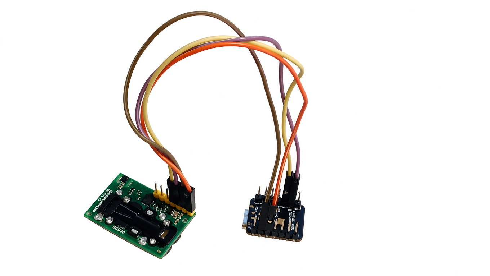
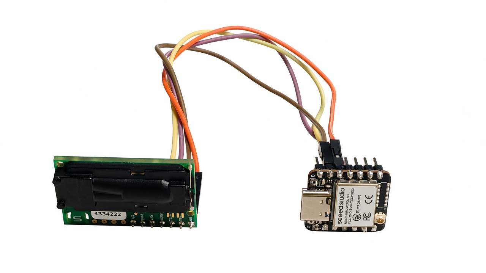

# SCD30-Wemos

ESP32-pohjainen SCD30-mittausprojekti, jossa samaa Sensirion SCD30 -anturia käytetään kahdella eri mikrokontrollerialustalla:

- **Wemos D1 R32 / ESP32**
- **Seeed Studio XIAO ESP32-S3**

Molemmat versiot lukevat SCD30-anturilta:

- CO₂-pitoisuuden
- lämpötilan
- suhteellisen kosteuden

Mittaustiedot julkaistaan MQTT-brokerille JSON-muodossa.

Projektissa on lisäksi WiFi-asetusportaali, jonka avulla WiFi- ja MQTT-asetukset voidaan määrittää ilman tunnusten kirjoittamista lähdekoodiin.

## Versiot

### V5 Basic

V5 on helposti seurattava oppimisversio. Se on hyvä lähtökohta ESP32-, WiFi-, WebServer-, Preferences- ja MQTT-ohjelmoinnin opiskeluun.

### V6 Secure

V6 perustuu suoraan vastaavaan V5-versioon, mutta korjaa keskeisiä tietoturvaongelmia.

V6-versiot:

```text
examples/
├── SCD30_WEMOS-D1R32-ESP32_WLAN_MQTT_v6/
│   └── SCD30_WEMOS-D1R32-ESP32_WLAN_MQTT_v6.ino
│
└── SCD30_XIAO-ESP32-S3_WLAN_MQTT_WIFI_v6/
    └── SCD30_XIAO-ESP32-S3_WLAN_MQTT_WIFI_v6.ino
```

---

# Mikrokontrollerit

| Ominaisuus | Wemos D1 R32 | XIAO ESP32-S3 |
|---|---|---|
| MCU | ESP32 | ESP32-S3 |
| SCD30 I²C SDA | GPIO21 | GPIO5 |
| SCD30 I²C SCL | GPIO22 | GPIO6 |
| WiFi | 2,4 GHz | 2,4 GHz |
| MQTT | Kyllä | Kyllä |
| WiFi-asetusportaali | Kyllä | Kyllä |
| V6 TLS | Kyllä | Kyllä |

Sama SCD30-koodi on siis sovitettu kahdelle eri ESP32-mikrokontrollerille. Käytännössä tärkein alustakohtainen ero tässä projektissa on I²C-pinnien määritys.

---

# Kytkentä

## Wemos D1 R32

| SCD30 | Wemos D1 R32 | Tarkoitus |
|---|---|---|
| VIN | 3V3 | Käyttöjännite |
| GND | GND | Maa |
| SDA | GPIO21 / SDA | I²C-data |
| SCL | GPIO22 / SCL | I²C-kello |

## XIAO ESP32-S3

| SCD30 | XIAO ESP32-S3 | Tarkoitus |
|---|---|---|
| VIN | 3V3 | Käyttöjännite |
| GND | GND | Maa |
| SDA | GPIO5 | I²C-data |
| SCL | GPIO6 | I²C-kello |

SCD30:n I²C-osoite on:

```text
0x61
```

---

# Kuvat

Repositoryn `images`-kansiossa on tällä hetkellä:

- `scd30-wemos.jpg`
- `scd30-sensor.jpg`
- `scd30-wemos-wiring.jpg`
- `scd30-speedstudio-1.jpg`
- `scd30-speedstudio-2.jpg`

# Kuvat

## Koko laitteisto


## SCD30-anturi


## Käytännön kytkentä


## SCD30-anturi – SpeedStudio






## SCD30-anturi


## Käytännön kytkentä


---

# V5 → V6

V6:n lähtökohtana ovat GitHubissa olevat:

- `SCD30_WEMOS-D1R32-ESP32_WLAN_MQTT_v5.ino`
- `SCD30_XIAO-ESP32-S3_WLAN_MQTT_WIFI_v5.ino`

Molemmissa V5-ohjelmissa on sama perusrakenne. Wemos käyttää:

```cpp
Wire.begin(21, 22);
```

ja XIAO ESP32-S3:

```cpp
Wire.begin(5, 6);
```

Muu WiFi-, MQTT-, WebServer- ja SCD30-toiminta on rakennettu samalla periaatteella.

---

# V6:n tietoturvaparannukset

## 1. MQTT TLS -varmenteen tarkistus

V5 käyttää:

```cpp
wifiClient.setInsecure();
```

Tämä tarkoittaa, ettei MQTT-palvelimen TLS-varmennetta tarkisteta.

V6 käyttää:

```cpp
wifiClient.setCACert(ROOT_CA);
```

V6:ssa on mukana **ISRG Root X1** -juurivarmenne Let's Encrypt -sertifikaattiketjuja varten.

Let's Encrypt ylläpitää ajantasaista tietoa ISRG Root X1 -juurivarmenteesta omalla sertifikaattisivullaan. citeturn4search0turn4search1

Jos käytät muuta MQTT-brokeria tai muuta CA:ta, vaihda `ROOT_CA` vastaamaan brokerin sertifikaattiketjua.

> **Älä muuta V6:ssa `setCACert()`-kutsua takaisin `setInsecure()`-kutsuksi, jos tavoitteena on TLS-varmenteen oikea tarkistus.**

## 2. NTP-aika

Tässä V6-versiossa TLS-varmennetta ei ohiteta `setInsecure()`-ratkaisulla.

Huomio: ESP32:n TLS-varmenteen tarkistukseen tarvitaan oikea kellonaika. Jos käytössä oleva ESP32-ympäristö ei ole vielä synkronoinut aikaa ennen TLS-yhteyttä, yhteyden muodostaminen voi epäonnistua.

Jos käytät brokeria, joka edellyttää TLS-yhteyttä, NTP-synkronointi kannattaa varmistaa ennen MQTT-yhteyttä.

## 3. Salasanoja ei palauteta HTML-lomakkeeseen

V5:ssa nykyinen salasana sijoitetaan suoraan HTML:n `value`-kenttään.

V6:ssa:

```html
<input type="password" ... value="">
```

Nykyistä salasanaa ei siis lähetetä takaisin selaimelle.

Jos käyttäjä jättää salasanakentän tyhjäksi, V6 säilyttää nykyisen salasanan.

## 4. Salasanoja ei tulosteta Serial Monitoriin

V6 ei tulosta tallennettua WiFi- tai MQTT-salasanaa Serial Monitoriin.

## 5. Portal token

Kun WiFi-asetusportaali käynnistyy, V6 muodostaa `esp_random()`-funktiolla satunnaisen tokenin.

Token vaaditaan asetusten tallennukseen ja MQTT-yhteystestiin.

## 6. Asetusten muuttaminen vain portal-tilassa

V5 rekisteröi `/save`- ja `/mqtt-test`-endpointit myös normaalissa WiFi-tilassa.

V6 ei rekisteröi näitä endpointteja normaalissa STA-tilassa.

Asetusten muuttaminen tapahtuu siis vain WiFi-asetusportaalissa.

## 7. Satunnainen AP-salasana

V6 muodostaa WiFi-asetusportaalille uuden satunnaisen AP-salasanan jokaisella portal-tilan käynnistyskerralla.

Salasana muodostetaan `esp_random()`-arvoista.

Salasana tulostetaan Serial Monitoriin:

```text
AP name: SCD30-Setup-XXXXXX
AP password: XXXXXXXXXXXXXXXX
```

## 8. HTML escaping

Käyttäjän syöttämät tiedot käsitellään `htmlEscape()`-funktiolla ennen niiden lisäämistä HTML-sivulle.

Tämä estää esimerkiksi `<`, `>`, `"` ja `'` -merkkien päätymisen suoraan HTML-rakenteeseen.

## 9. Syötteiden validointi

V6 tarkistaa palvelinpuolella muun muassa:

- SSID:n enimmäispituuden
- WiFi-salasanan enimmäispituuden
- MQTT-palvelimen enimmäispituuden
- MQTT-käyttäjänimen enimmäispituuden
- MQTT-salasanan enimmäispituuden
- MQTT-topicin enimmäispituuden
- MQTT-portin alueen 1–65535
- pakolliset kentät

## 10. Yksilöllinen MQTT Client ID

V5 käyttää kaikille laitteille samaa Client ID:tä:

```text
ESP32-SCD30
```

V6 muodostaa Client ID:n laitteen MAC-osoitteen perusteella:

```text
ESP32-SCD30-A1B2C3D4E5F6
```

Tämä on tärkeää, jos samassa MQTT-brokerissa käytetään useita SCD30-laitteita.

## 11. HTTP security headers

V6 lisää HTTP-vastauksiin muun muassa:

```text
Cache-Control: no-store
Pragma: no-cache
X-Content-Type-Options: nosniff
X-Frame-Options: DENY
Referrer-Policy: no-referrer
Content-Security-Policy
```

---

# V5 ja V6

| Ominaisuus | V5 | V6 |
|---|:---:|:---:|
| SCD30 | ✅ | ✅ |
| WiFi | ✅ | ✅ |
| WiFi-asetusportaali | ✅ | ✅ |
| MQTT | ✅ | ✅ |
| MQTT-yhteystesti | ✅ | ✅ |
| MQTT TLS | ⚠️ | ✅ |
| TLS-varmenteen tarkistus | ❌ | ✅ |
| Salasanojen palauttaminen HTML:ään | ⚠️ | ❌ |
| Salasanojen tulostaminen Serial Monitoriin | ⚠️ | ❌ |
| Portal token | ❌ | ✅ |
| Asetusendpointit vain portal-tilassa | ❌ | ✅ |
| Satunnainen AP-salasana | ❌ | ✅ |
| HTML escaping | ❌ | ✅ |
| Syötteiden validointi | Perustaso | ✅ |
| Yksilöllinen MQTT Client ID | ❌ | ✅ |
| HTTP security headers | ❌ | ✅ |
| Boot count | ✅ | ✅ |
| Reset reason | ✅ | ✅ |
| Device Information | ✅ | ✅ |
| Uptime | – | ✅ |

---

# MQTT

Molemmat mikrokontrolleriversiot lähettävät saman JSON-rakenteen:

```json
{
  "co2": 561,
  "temperature": 27.68,
  "humidity": 35.95
}
```

| Kenttä | Selitys |
|---|---|
| `co2` | CO₂-pitoisuus ppm |
| `temperature` | lämpötila °C |
| `humidity` | suhteellinen kosteus % |

Oletustopic:

```text
scd30/data
```

Oletusportti:

```text
8883
```

---

# WiFi-asetusportaali

Jos WiFi-asetuksia ei ole tallennettu tai WiFi-yhteyden muodostaminen epäonnistuu, laite käynnistää oman WiFi-asetusverkon.

V6:n verkko on muotoa:

```text
SCD30-Setup-XXXXXX
```

Salasana muodostetaan satunnaisesti laitteen käynnistyessä.

Asetustilassa käyttäjä voi määrittää:

- WiFi SSID:n
- WiFi-salasanan
- MQTT-palvelimen
- MQTT-portin
- MQTT-käyttäjänimen
- MQTT-salasanan
- MQTT-topicin

Asetussivulla voidaan myös testata MQTT-yhteys ennen asetusten tallentamista.

---

# Device Information

V5:ssä jo oleva Device Information -sivu on säilytetty V6:ssa.

Sivulla näytetään muun muassa:

- ESP32-malli
- chip revision
- CPU-ytimien määrä
- CPU-taajuus
- flash-muistin koko
- vapaa heap-muisti
- sketchin koko
- vapaa sketch-tila
- Arduino Core -versio
- ESP-IDF-versio
- MAC-osoite
- IP-osoite
- gateway
- DNS
- RSSI
- boot count
- reset reason
- reset reasonin numeerinen arvo
- laitteen uptime
- SCD30:n I²C-osoite

Reset reason näytetään esimerkiksi muodossa:

```text
Software reset (3)
```

---

# PermissionError Windowsissa

ESP32-firmwarea ladattaessa voi esiintyä:

```text
PermissionError(13, 'Access is denied.')
```

tai:

```text
SerialException: could not open port 'COMx'
PermissionError(13, 'Access is denied.')
```

Tämä ei välttämättä tarkoita, että Arduino-koodissa on virhe.

Ongelma voi liittyä esimerkiksi:

- Windowsin COM-porttiin
- USB-sarjaportin ajuriin
- toisen ohjelman käyttämään COM-porttiin
- USB-kaapeliin
- USB-porttiin
- `esptool`-ohjelmaan
- ESP32-korttipakettiin

## Espressif esptool issue #682

Espressifin `esptool`-projektissa on dokumentoitu vastaava Windows/COM-portti/`PermissionError(13)` -ongelma:

[Espressif esptool – PermissionError(13, 'Access is denied.') #682](https://github.com/espressif/esptool/issues/682)

Issue #682 liittyy alkuperäisesti ESP8266/Windows/esptool-ympäristöön, mutta se on hyödyllinen viite samantyyppisen COM-porttiongelman selvittämiseen.

### Kokeile

1. Sulje Arduino IDE.
2. Irrota kortti USB-kaapelista.
3. Varmista, ettei toinen ohjelma käytä COM-porttia.
4. Liitä kortti uudelleen.
5. Tarkista COM-portti Windowsin Laitehallinnasta.
6. Käynnistä Arduino IDE uudelleen.
7. Kokeile toista USB-porttia.
8. Tarkista USB-sarjaportin ajuri.
9. Kokeile toista USB-kaapelia.
10. Kokeile upload-nopeudeksi esimerkiksi `115200`.

### Aloittelijalle tärkeä ero

```text
Arduino-koodi
      │
      ▼
   Käännös
      │
      ├── ❌ Compile error
      │       → koodiongelma
      │
      ▼
 Firmware valmis
      │
      ▼
   esptool
      │
      ▼
 Windows / USB / COM
      │
      └── ❌ PermissionError
              → latausympäristön ongelma
```

Jos ohjelma kääntyy onnistuneesti, älä muuta toimivaa Arduino-koodia vain siksi, että firmwareen lataaminen epäonnistuu.

---

# Arduino IDE

Asenna:

- USB-serial versio CH340-3.4.2014.8
- Arduino IDE
- ESP32-korttipaketti
- Adafruit SCD30
- PubSubClient

## Wemos D1 R32

Valitse esimerkiksi:

```text
ESP32 Dev Module
```

SCD30:

```text
Wire.begin(21, 22);
```

## XIAO ESP32-S3

Valitse Arduino IDE:ssä XIAO ESP32-S3:n mukainen kortti.

SCD30:

```text
Wire.begin(5, 6);
```

---

# Suositeltu oppimispolku

1. Aloita Wemos D1 R32:n V5-versiosta.
2. Opettele SCD30:n I²C-kommunikaatio.
3. Opettele ESP32:n WiFi.
4. Opettele WebServer.
5. Opettele Preferences/NVS.
6. Opettele MQTT.
7. Tutki V5:n tietoturvarajoituksia.
8. Vertaa Wemos V5 → V6.
9. Vertaa XIAO V5 → V6.
10. Tutki, mitkä osat ovat alustariippumattomia ja mitkä liittyvät I²C-pinneihin.
11. Testaa MQTT TLS -yhteys.
12. Kehitä oma V7.

Tämä tekee projektista hyvän harjoituksen myös ohjelmakoodin uudelleenkäytöstä: sama sovelluslogiikka voidaan siirtää toiselle ESP32-alustalle vaihtamalla vain tarvittavat laitteistokohtaiset osat.

---

# Tietoturvahuomio

V6 on selvästi V5:tä turvallisempi, mutta sitä ei ole suunniteltu suoraan Internetiin altistettavaksi Web-palvelimeksi.

Rajoituksia:

- WiFi-asetusportaali käyttää HTTP:tä, ei HTTPS:ää.
- MQTT TLS suojaa MQTT-yhteyden, mutta ei paikallista HTTP-asetusliikennettä.
- AP-salasana tulostetaan Serial Monitoriin asetustilan aikana.
- ESP32:n resurssit rajoittavat WebServerin ominaisuuksia.
- Laitetta ei tule asettaa suoraan Internetiin ilman erillistä suojausta.

V6 on tarkoitettu ensisijaisesti **luotettuun paikalliseen IoT-verkkoon**.

---

# Tuleva V7

Mahdollisia jatkokehityskohteita:

- HTTPS-asetusportaali
- OTA-päivitys
- MQTT Last Will
- online/offline-tila
- parempi virheenkäsittely
- sensorin tilan valvonta
- sertifikaatin vaihtaminen asetussivulta
- sertifikaattien automaattinen päivitys
- salaisuuksien parempi suojaus NVS-muistissa
- yhteinen alustariippumaton kirjasto Wemos- ja XIAO-versioille

---

# Lisenssi

Tämä projekti on julkaistu [MIT-lisenssillä](LICENSE).

Copyright © 2026 Tero Leinonen.
